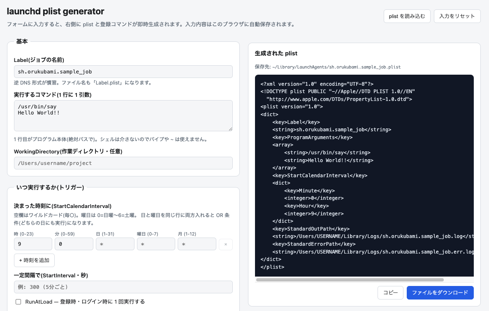

# launchd plist generator

https://launchd-plist-generator.orukubami.sh

macOSのlaunchd用plistを、フォーム入力だけで生成できるツールです。  
あわせてlaunchdの日本語解説ドキュメントを収録しています。



## 使い方

https://launchd-plist-generator.orukubami.sh にアクセスするか、
`index.html` をブラウザで開くだけです。

```sh
open index.html
```

## できること

- フォームに入力すると **plist XML** と **登録・テスト・解除の launchctl コマンド一式**を即時生成
- 決まった時刻(複数可)・一定間隔・ログイン時・ファイル監視・フォルダ監視の各起動トリガーに対応
- ログ・環境変数・作業ディレクトリ・KeepAlive(再起動ポリシー)・ProcessType などの実用キーに対応
- ありがちなミスを入力中に自動チェック(コマンドが絶対パスでない、`~` の使用、シェル記号、
  時刻の範囲外、トリガーなし、エラーログ未設定 など)
- 生成した plist はコピーまたはファイルとしてダウンロード可能
- 既存の .plist ファイルを読み込んでフォームに展開(ファイル選択またはドラッグ & ドロップ。
  このツールで表現できないキーや値は、上書き前の確認ダイアログで喪失警告を表示)
- 入力内容はブラウザに自動保存され、次に開いたとき復元される(リセットボタン付き)

## CLI (既存 plist の診断)

`bin/launchd-plist` は、すでにある `.plist` ファイルを診断するための依存ゼロの Node CLI です
(macOS 限定。`plutil`/`launchctl` を利用します)。生成機能は持たず、ブラウザ版と役割を分けています。
実行には Node.js が必要です。[mise](https://mise.jdx.dev/) を使っている場合はリポジトリ直下で
`mise install` すると `.mise.toml` で固定した Node バージョンが有効になります(必須ではなく、
システムに Node があればそのまま動きます)。

```sh
# 静的検証のみ (Label・パス・トリガーなどの書式チェック)
node bin/launchd-plist check ~/Library/LaunchAgents/com.example.myjob.plist

# check に加え、実行ファイル・ディレクトリの存在や launchd への登録状態も診断 (読み取り専用)
node bin/launchd-plist doctor ~/Library/LaunchAgents/com.example.myjob.plist

# CI 向け: 警告のみでも exit code を 1 にする / 結果を JSON で受け取る
node bin/launchd-plist check some.plist --strict
node bin/launchd-plist check some.plist --json
```

エラー・警告メッセージには [docs/guide.md](docs/guide.md) の該当節へのリンクが付きます。
詳細な設計は [docs/cli-plan.md](docs/cli-plan.md) を参照してください。

## ドキュメント

launchd の仕組みを知りたい人向けに、詳しさの段階別に [docs/](docs/) にまとめてあります。

| ドキュメント | 対象 |
|---|---|
| [docs/hajimete-no-launchd.md](docs/hajimete-no-launchd.md) | はじめての人向け。たとえ話とハンズオンで学ぶ入門 |
| [docs/intro.md](docs/intro.md) | 最小の plist と 3 ステップの手順だけの入門 |
| [docs/guide.md](docs/guide.md) | 実用ガイド。仕組み・主要キー・Claude Code のスケジュール実行・セキュリティ・料金 |
| [docs/reference.md](docs/reference.md) | 網羅的リファレンス。全キー・launchctl 全サブコマンド・ドメインの詳細 |
| [docs/use-cases.md](docs/use-cases.md) | ユースケース集。生成 AI のスケジュール起動・バックアップ・ファイル自動整理など |
